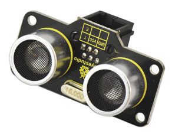
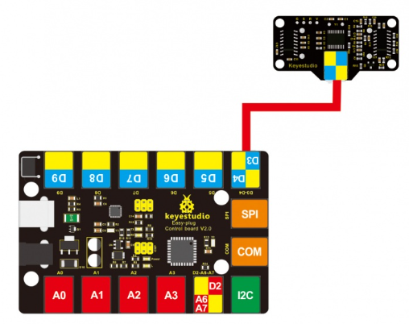
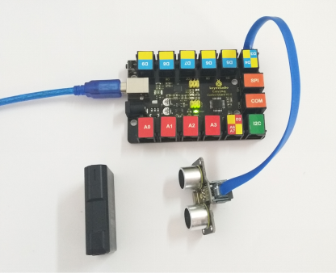
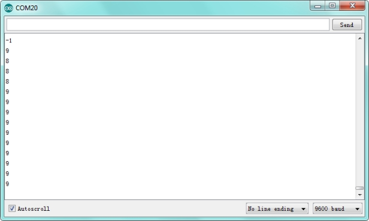

# KS0242 keyestudio EASY plug SR01 Ultrasonic Module



## 1. Introduction

The distance sensor are really common in robotics projects, very useful for automation, interactive art and motion sensing.

This EASY Plug SR01 Ultrasonic integrates ultrasonic transmitter, receiver and corresponding control circuit.

It should be connected to the double digital interface with only one line, which is very easy to use and convenient for connection.

The module comes with four fixed holes, so that can easily fix it on other devices, such as the servo plastic platform and so on.

This module should be used together with EASY plug control board.

**Special Note:**

The sensor/module is equipped with the RJ11 6P6C interface, compatible with our keyestudio EASY plug Control Board with RJ11 6P6C interface.

If you have the control board of other brands, it is also equipped with the RJ11 6P6C interface but has different internal line sequence, can’t be used compatibly with our sensor/module.

## 2. Specification

- Operating Voltage: DC 5V
- Operating Current: 15mA
- Operating Frequency: 40KHz
- Max Range: 3--5m
- Min Range: 2cm
- Measuring Angle: 15 degree
- Trigger Input Signal: 10µS TTL pulse
- Interface： double digital

## 3. Technical Details

- Dimensions: 49mm * 26mm * 28mm
- Weight: 11.3g

## 4. Connect It Up

Connect the EASY Plug Ultrasonic module to control board using an RJ11 cable. Then connect the control board to your PC with a USB cable.



## 5. Upload the Code

Download code : [Code](./Code.7z)

```c
#define echoPin 4 // Echo Pin
#define trigPin 3// Trigger Pin
#define LEDPin 13 // Onboard LED

int maximumRange = 200; // Maximum range needed
int minimumRange = 0; // Minimum range needed
long duration, distance; // Duration used to calculate distance

void setup() 
{
  Serial.begin (9600);
  pinMode(trigPin, OUTPUT);
  pinMode(echoPin, INPUT);
  pinMode(LEDPin, OUTPUT); // Use LED indicator (if required)
}

void loop() 
{
  /* The following trigPin/echoPin cycle is used to determine the
  distance of the nearest object by bouncing soundwaves off of it. */ 
  digitalWrite(trigPin, LOW); 
  delayMicroseconds(2); 

  digitalWrite(trigPin, HIGH);
  delayMicroseconds(10); 
  digitalWrite(trigPin, LOW);

  duration = pulseIn(echoPin, HIGH);
  //Calculate the distance (in cm) based on the speed of sound.
  distance = duration/58.2;
 
  if (distance >= maximumRange || distance <= minimumRange)
  {
      /* Send a negative number to computer and Turn LED ON 
      to indicate "out of range" */
      Serial.println("-1");
      digitalWrite(LEDPin, HIGH); 
  }
  else 
  {
     /* Send the distance to the computer using Serial protocol, and
     turn LED OFF to indicate successful reading. */
     Serial.println(distance);
     digitalWrite(LEDPin, LOW); 
  }
  //Delay 50ms before next reading.
  delay(50);
}
```

## 6. Result

Done uploading the code, open the serial monitor and set the baud rate to 9600. You should see the measured distance between the ultrasonic sensor and front obstacle.

 

